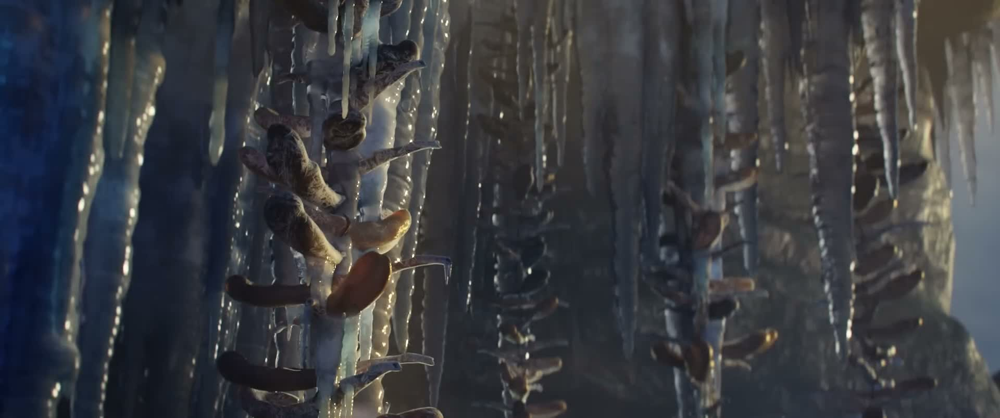
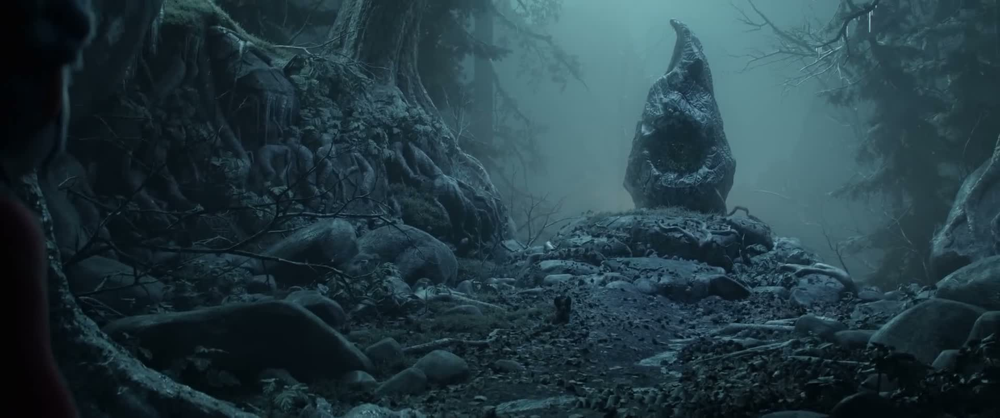
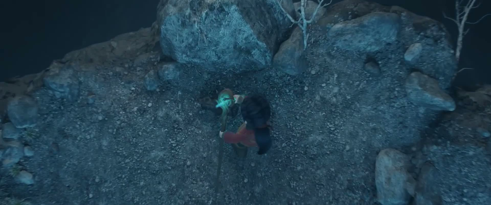

# IIIT-H Online Internship Progress

## Week 01

## Task 1 - Frame Extraction
- Extracted frames from a video using FFmpeg  
- Used `fps=1` to generate images  

# >> Note: A different source video was used for Task 1 compared to Tasks 2 and 3.

### Sample Images:
  
  

## Task 2 - Image to Video Reconstruction

- Used a separate video clip for processing  
- Extracted a 1-minute segment  
- Generated ~1800 frames at 30 FPS  
- Reconstructed video from extracted frames  

 [Output Video](https://github.com/GADDAMADVITH/IIIT-H_ONLINE_INTERNSHIP_PROGRESS/raw/main/output.mp4)

## Task 3 - Audio Video Integration
- Selected a background audio track  
- Trimmed audio to 60 seconds  
- Merged audio with reconstructed video using FFmpeg  

 [Final Video](https://github.com/GADDAMADVITH/IIIT-H_ONLINE_INTERNSHIP_PROGRESS/raw/main/final_output.mp4)

## Tools Used
- FFmpeg  
