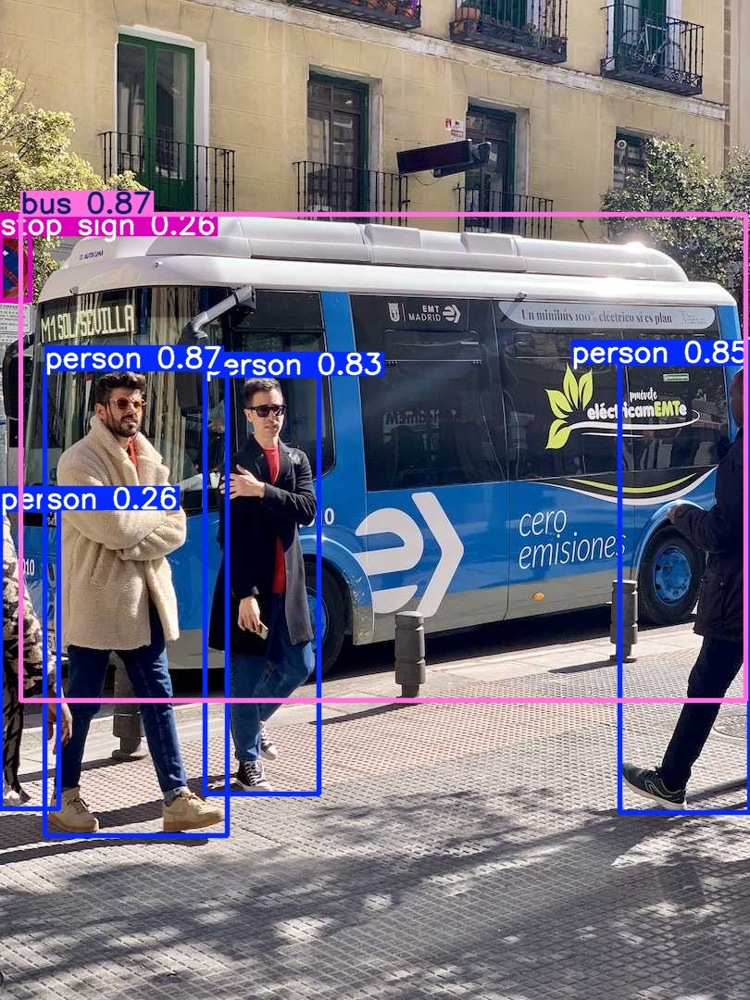
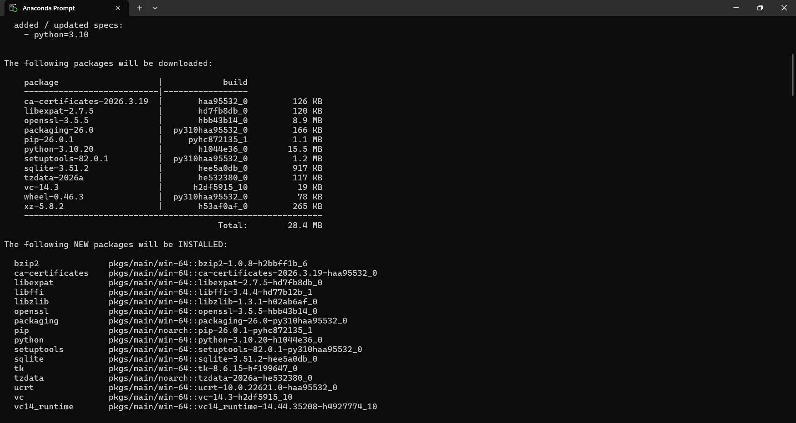
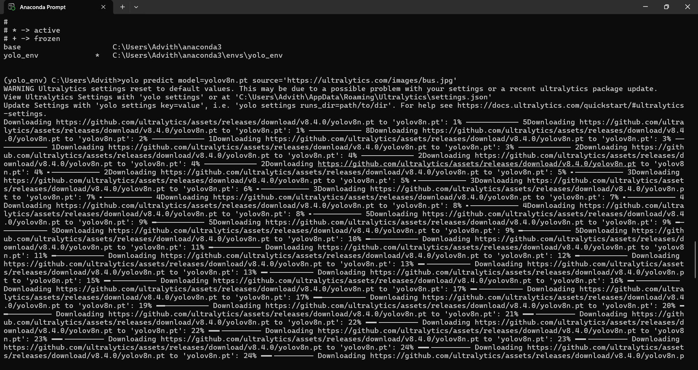

# Week 02 - Tasks 1, 2, 3

# Task 1 - Virtual Environment
- Created virtual environment using Anaconda (Python 3.10)
- Activated using `conda activate yolo_env`

# Task 2 - Ultralytics Installation
- Installed ultralytics using pip
- Installed dependencies like torch, numpy, opencv

# Task 3 - Object Detection
- Used pretrained YOLOv8 model
- Ran detection on sample image

# Output

# Screenshots

# Installation

# Detection

# Extra Task - Object Detection Video

- Applied YOLOv8 on multiple images (car racing dataset)
- Generated annotated images
- Converted images into video using FFmpeg
- Added background audio

### 🎥 Final Video:
[Watch Video](https://github.com/GADDAMADVITH/IIIT-H_ONLINE_INTERNSHIP_PROGRESS/raw/main/final_video.mp4)

---
