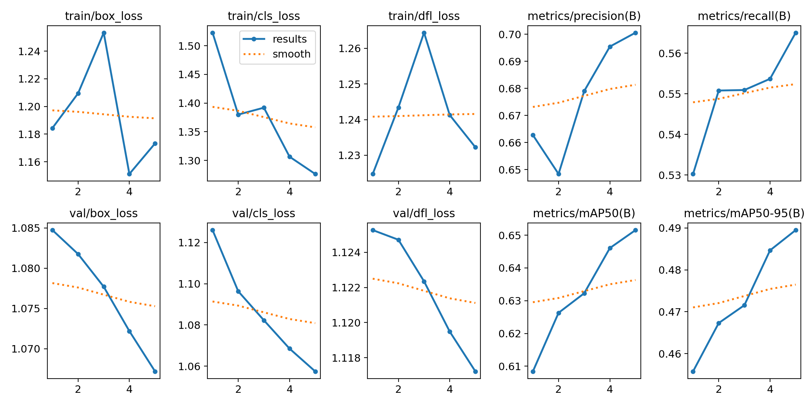
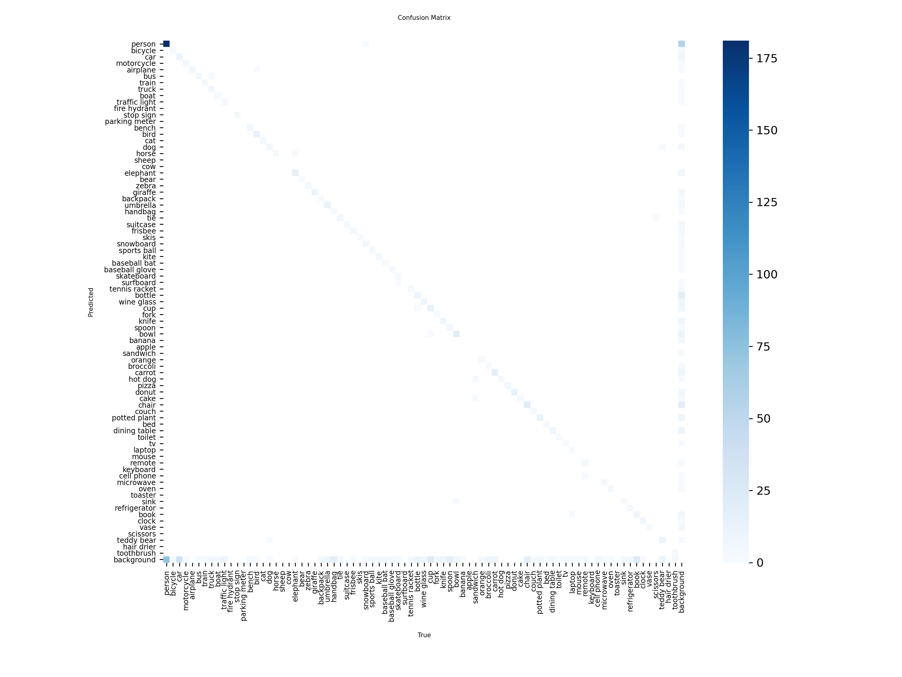

# Week 03 - Segmentation and Performance Metrics

## Task Completed
- Performed semantic segmentation using YOLOv8 segmentation model
- Applied segmentation on the video/images used in Week 02
- Generated segmented video output
- Added background music to the segmented output video

## Output Video
[Segmented Video](https://github.com/GADDAMADVITH/IIIT-H_ONLINE_INTERNSHIP_PROGRESS/main/week_03/clip2_with_audio.mp4)

## Performance Metrics

### Results Curve

### Confusion Matrix

## Sample Metrics
- Preprocess Speed: 3.0 ms
- Inference Speed: 134.0 ms
- Postprocess Speed: 3.3 ms

## Observations
- Common objects showed better detection accuracy
- Precision and recall varied across different object classes
- Some rare objects had lower confidence scores
- Segmentation provided more detailed object boundaries compared to bounding boxes
